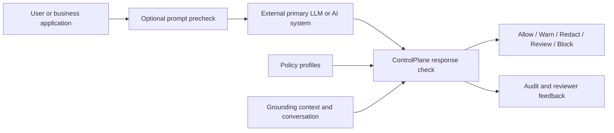
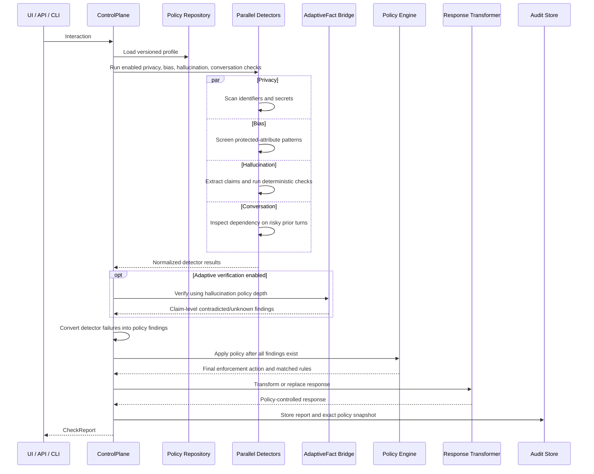

# ControlPlane.ai: Overall Architecture and Review

Status reviewed: 2026-08-25  
Repository test status: **80 tests passed**  
Latest completed-pack evaluation: **15,000 synthetic records validated; 2,000-case frozen test executed**

## 1. Problem statement

Organizations want to use large language models in customer support, internal knowledge work, and regulated decision-support workflows. A raw LLM response, however, can create several risks at the same time:

- It can expose personal information, payment-card data, credentials, or secrets.
- It can state unsupported or contradicted facts.
- It can introduce stereotypes or adverse treatment based on protected attributes.
- It can repeat and amplify a risky statement from an earlier conversation turn.
- The correct response may depend on organizational policy and the seriousness of the use case.

A normal LLM API does not provide a dependable, organization-specific enforcement boundary. Asking the same model to “be safe” is not enough because generation and safety enforcement remain coupled, the decision is difficult to audit, and failures can silently reach the user.

### The problem this project solves

ControlPlane.ai places a policy-controlled safety gateway around an AI response. It receives the prompt, proposed response, available grounding evidence, conversation history, and use-case profile. It then:

1. detects overlapping risks;
2. performs factual verification at the configured depth;
3. converts every result into a common finding format;
4. applies a versioned organizational policy;
5. allows, warns, redacts, holds, or blocks the response;
6. records an auditable explanation of what happened.

The project is therefore not trying to prove that an LLM is always truthful. It is trying to prevent an unverified AI response from being released without the checks and controls appropriate to its use case.

### Input and output

The runtime input is a provider-independent `Interaction` containing:

- policy profile;
- prompt;
- proposed model response;
- optional grounding context;
- optional conversation turns and prior risk scores;
- whether the request is consequential;
- optional geography, industry, model, and application metadata.

The output is a `CheckReport` containing:

- original and policy-controlled responses;
- final enforcement action;
- normalized findings and detector results;
- matched policy rules;
- verification depth and risk score;
- total latency;
- policy ID and version;
- audit-event identifier.

## 2. The simplest mental model

There are three different things that should not be confused:

| Part | What it actually is | What it is not |
|---|---|---|
| Streamlit demo | A visual interface that collects inputs and displays a report | The safety controller itself |
| ControlPlane | The runtime orchestrator, policy engine, enforcement layer, and audit boundary | Merely a dashboard |
| AdaptiveFact | The factual claim extraction and evidence-verification subsystem | The complete privacy, bias, policy, or UI system |

The demo is connected to the real ControlPlane class. The API and CLI call the same class. AdaptiveFact is also connected, but its heavier NLI/agent verification is opt-in because it requires ML dependencies, model weights, and more latency.

```text
Streamlit UI ─┐
FastAPI API ──┼──> ControlPlane.check(...) ──> controlled response + report
CLI ──────────┘                 │
                               └──> optional AdaptiveFact verification
```

This means the user interface can be replaced without changing the safety logic, and the factual verifier can be upgraded without rewriting policy enforcement.

## 3. System boundary



The primary answer-generating LLM is intentionally outside the project boundary. ControlPlane is provider-independent and can sit in front of responses from OpenAI, another hosted provider, or a local model.

## 4. End-to-end runtime flow



The ordering is important: **the final policy decision is made after adaptive verification finishes**. Deep findings can therefore change the final action.

## 5. Component map: which part solves which problem

| Component | Location | Problem solved | Current method |
|---|---|---|---|
| Runtime orchestrator | `src/controlplane/checker.py` | Coordinates checks and prevents isolated tools from becoming separate products | Parallel detector execution, adaptive bridge, normalization, policy, transformation, audit |
| Request/report schema | `src/controlplane/schema.py` | Keeps all model providers and clients on one contract | Pydantic models and enums |
| Policy repository | `src/controlplane/policy/loader.py` | Loads use-case-specific governance configuration | Versioned YAML profiles |
| Policy engine | `src/controlplane/policy/engine.py` | Converts findings into an explainable operational action | Explicit rule matching and strongest-action precedence |
| Privacy detector | `src/controlplane/detectors/privacy.py` | Finds sensitive inputs and output spans | Regex, overlap control, phone/Aadhaar/card disambiguation, Luhn validation |
| Bias detector | `src/controlplane/detectors/bias.py` | Screens obvious stereotypes and adverse protected-attribute decisions | High-precision lexical patterns and optional counterfactual comparison |
| Basic hallucination detector | `src/controlplane/detectors/hallucination.py` | Provides a low-latency factuality screen | Claim extraction, deterministic support/conflict checks, optional trained risk model |
| Conversation detector | `src/controlplane/detectors/conversation.py` | Detects propagation of a risky earlier statement | Prior-risk score plus dependency-language patterns |
| ControlPlane/AdaptiveFact bridge | `src/controlplane/verification.py` | Makes configured verification depth execute real factual verification | Phase 5, Phase 6 NLI, and bounded-agent dispatch |
| Claim extraction | `src/adaptivefact/extraction/` | Turns a response into units that can be independently checked | Rule-based atomic-claim extraction plus entity/number/date extraction |
| Deterministic verification | `src/adaptivefact/verification/deterministic.py` | Quickly resolves exact or structured evidence matches | Text, number, and date comparison |
| Retrieval and NLI | `src/adaptivefact/verification/phase6.py` | Determines whether evidence supports, contradicts, or does not resolve a claim | Evidence retrieval plus transformer NLI |
| Bounded evidence agent | `src/adaptivefact/agents/verifier.py` | Searches approved evidence again when ordinary NLI remains uncertain | Limited iterations, sources, NLI pairs, latency, and cost |
| Aggregation | `src/adaptivefact/pipeline/aggregation.py` | Converts claim statuses into a response-level factual status | Contradiction and important-unknown rules |
| Response transformer | `src/controlplane/actions/response_transformer.py` | Ensures the returned text follows the final action | Allow, append warning, span redaction, review replacement, block replacement |
| Audit and feedback | `src/controlplane/audit/store.py` | Makes decisions reviewable and supports future correction | JSONL report, policy snapshot, privacy-aware persistence, reviewer feedback |
| FastAPI service | `src/controlplane/api.py` | Provides application integration | Health, policies, precheck, check, and feedback endpoints |
| Streamlit demo | `demo/app.py` | Makes the system understandable during demonstration | Calls the same ControlPlane runtime and displays findings |
| Evaluation runner | `src/controlplane/evaluation.py` | Measures actions, categories, subtypes, safety, intervention, and latency | Frozen JSONL scenario evaluation |

## 6. ControlPlane and AdaptiveFact relationship

### ControlPlane owns operational safety

ControlPlane decides what is released. It owns:

- the common finding format;
- use-case policy profiles;
- final action precedence;
- response redaction or replacement;
- detector-failure handling;
- audit records and human feedback;
- API, CLI, and UI integration.

### AdaptiveFact owns factual evidence analysis

AdaptiveFact answers narrower questions:

- What factual claims exist in this response?
- Does supplied or retrieved evidence support each claim?
- Does evidence contradict a claim?
- Is the evidence insufficient or conflicting?
- Which claims can be safely retained during research-pipeline remediation?

AdaptiveFact does not decide the organization-wide privacy or bias policy. Its factual outputs are converted into ControlPlane findings, and ControlPlane makes the final enforcement decision.

### Why the separation is correct

Factual status and business action are different concepts. A contradicted claim might receive a warning in low-impact customer support but require human review in a regulated decision. Similarly, an unknown claim must not automatically mean “false,” and a supported factual claim may still contain private information or biased language.

## 7. Verification depth

When adaptive verification is enabled, the hallucination depth in the active policy controls execution:

| Depth | Execution | Purpose | Current limits |
|---|---|---|---|
| `quick` | Claim extraction plus deterministic verification | Fast exact/structured checks | No transformer NLI |
| `standard` | Quick plus retrieval/NLI on unresolved claims | Better semantic support and contradiction detection | Up to 8 unresolved claims |
| `deep` | Standard plus bounded evidence agent | Resolve important uncertainty using approved evidence tools | Up to 20 NLI claims and 5 agent claims |

The environment-built product agent currently searches only supplied context. The separate research runner can also add an approved local corpus.

The bounded agent is not an unconstrained autonomous LLM. It is a controlled evidence-search loop with maximum iterations, search calls, NLI pairs, sources, latency, and cost. Conflicting or insufficient evidence remains `UNKNOWN`.

### Important configuration caveat

Adaptive verification is disabled by default. It becomes active only when:

```powershell
$env:CONTROLPLANE_ADAPTIVE_VERIFICATION='1'
$env:CONTROLPLANE_NLI_MODEL='cross-encoder/nli-deberta-v3-small'
```

Without this service, the basic hallucination detector still runs deterministic checks, but a profile declaring `standard` or `deep` does not by itself load or execute transformer NLI. The returned decision can still display the configured depth. Deployment health checks should therefore expose whether the adaptive backend is actually active.

Another current limitation is that depth affects the AdaptiveFact hallucination bridge only. For example, a profile can declare deep bias checking, but the current bias detector remains pattern-based; there is no separate deep bias model yet.

## 8. Result normalization

AdaptiveFact results are translated into the common ControlPlane schema before policy runs:

| AdaptiveFact result | ControlPlane result |
|---|---|
| `SUPPORTED` | No hallucination risk finding |
| `CONTRADICTED` | `hallucination / claim_contradicted` with contradicted status |
| `UNKNOWN` or `UNVERIFIED` | `hallucination / claim_unknown` |
| `MIXED` response | Separate claim-level contradicted and unknown findings are retained |

This normalization is what makes the two systems genuinely connected. Policy rules do not need to understand AdaptiveFact's internal objects.

## 9. Risk detectors

### 9.1 Privacy

The privacy detector scans the response and, depending on policy, the prompt and conversation. It currently detects:

- email addresses;
- US SSNs;
- Aadhaar numbers;
- phone numbers;
- Luhn-valid payment-card numbers;
- API keys and secrets matching configured formats;
- bearer tokens;
- private-key material.

Response findings contain exact spans and replacements. Prompt and conversation findings are reported but do not try to redact the response at unrelated offsets. Overlap rules prevent the same number from simultaneously becoming a phone, Aadhaar, and card finding.

### 9.2 Bias

The bias detector screens:

- explicit negative stereotypes;
- adverse actions associated with recognized protected-attribute words;
- decision-language changes in a caller-supplied counterfactual response.

This is a screening control, not a fairness certification. Its lexical vocabulary is currently narrow, which is visible in the benchmark results.

### 9.3 Hallucination

The low-latency detector extracts claims and looks for:

- supported deterministic matches;
- conflicting numbers or dates;
- entities absent from supplied context;
- elevated response-level risk when a compatible trained model exists;
- missing evidence when factual claims exist without context.

The optional AdaptiveFact bridge adds semantic NLI and bounded evidence search.

### 9.4 Conversation risk

The conversation detector combines earlier turn risk scores with dependency language in the current response. It is intended to catch a response that relies on an earlier high-risk conclusion rather than independently verifying it.

## 10. Policy and enforcement

Findings do not directly mutate a response. The policy engine compares every finding with the active profile's explicit rules. If several rules match, the strongest action wins:

```text
allow < allow_with_warning < redact < human_review < block
```

The final risk score is the maximum of severity weight multiplied by finding confidence. This score helps summarize findings; explicit rules still determine the action.

The latency budget is measured after verification; it does not interrupt an in-flight model call. If the configured allowance is exceeded during a consequential request, the system escalates to at least human review. The customer-support allowance is 30 seconds so CPU DeBERTa inference can complete normally. If an enabled detector or configured adaptive backend fails, ControlPlane creates a `policy / detector_failure` finding rather than silently passing.

### Policy profiles

| Profile | Intended use | Factual depth | Typical behavior |
|---|---|---|---|
| Customer support | Fast external responses | Standard when adaptive backend is enabled | Block secrets, redact output PII, warn for factuality or bias |
| Internal assistant | Balanced internal knowledge work | Standard | Block secrets, redact sensitive output, review high bias or compounding conversation risk |
| Regulated decision support | Consequential workflows | Deep | Human review for privacy, bias, contradiction, important evidence gaps, failures, or excessive latency |

Policy geography and industry values are metadata, not claims of legal compliance.

## 11. Response enforcement and audit

The response transformer applies the policy decision:

- `allow`: original response is returned;
- `allow_with_warning`: a profile-specific warning is appended;
- `redact`: detected output spans are replaced;
- `human_review`: the response is replaced with the profile's review message;
- `block`: the response is replaced with the profile's blocked message.

Every completed check can be written as a JSONL audit event containing the exact policy snapshot. By default, raw sensitive output is redacted before audit persistence. Reviewer feedback is stored separately and can record an overridden action.

Current persistence is suitable for a prototype. Production use requires authenticated storage, access control, retention policy, encryption, integrity protection, and a reviewer workflow.

## 12. Interfaces

All interfaces call the same runtime:

- FastAPI: `/health`, `/v1/policies`, `/v1/precheck`, `/v1/check`, `/v1/feedback`;
- CLI: one-request execution and JSON report;
- Streamlit: interactive hackathon demonstration;
- evaluation scripts: batch correctness and load testing.

`/v1/precheck` runs prompt-side controls before a prompt is sent to the primary model. `/v1/check` evaluates the proposed model response before release.

## 13. Models and frameworks

### What model is currently used?

The default lightweight ControlPlane path does not call a generative LLM. It uses deterministic detectors and rules.

The completed integrated evaluation used:

```text
cross-encoder/nli-deberta-v3-small
```

This is a natural-language-inference model used to judge claim/evidence relationships. It is not the model that generates the original business answer.

The comparison configuration also defines, but does not enable by default:

- a larger DeBERTa NLI model;
- a Terra evidence judge;
- a Sol evidence judge;
- hybrid DeBERTa plus Terra escalation.

API judges require credentials, incur cost, and must be evaluated on the same frozen, human-reviewed claim set before selection.

### Should the project use LangChain?

LangChain is not currently used, and it is not required for this architecture. The important behavior—bounded tools, budgets, policy control, typed schemas, normalized findings, and audit traces—is already implemented directly and transparently.

Adding LangChain would make sense only if the project later needs many interchangeable external tool connectors, provider abstractions, or complex workflow composition. It would not by itself improve factual accuracy, privacy detection, evaluation quality, or policy correctness. For the current hackathon system, the existing direct Python architecture is easier to audit and test.

## 14. Product routing versus research routing

The repository contains two related but distinct approaches:

### Product ControlPlane routing

The active policy profile chooses `quick`, `standard`, or `deep` factual verification. This is predictable, use-case-driven routing and is the path used by the API, CLI, and Streamlit application.

### AdaptiveFact research routing

The research pipeline calculates a calibrated hallucination-risk score and applies learned thresholds:

```text
risk < tau1          -> fast_accept
tau1 <= risk < tau2  -> lightweight
risk >= tau2         -> agentic
```

It also contains claim aggregation and evidence-grounded remediation experiments. This pipeline is useful for finding a better cost/safety tradeoff, but it is not the same object as the product policy router and is not the default API path.

A future architecture could combine them safely: policy would set maximum permitted risk and minimum required depth, while calibrated risk would selectively escalate within those limits.

## 15. Evaluation approach

The evaluation runner measures:

- exact final-action accuracy;
- unsafe-release rate: gold non-allow cases predicted as unconditional allow;
- over-intervention rate: gold allow cases receiving a stronger action;
- human-review rate;
- category and subtype precision, recall, and F1;
- median, p95, p99, mean, and maximum latency.

These metrics must be read together. A system can reduce unsafe release by warning on everything, but that would create unacceptable over-intervention. Conversely, high action accuracy can hide dangerous false allows.

## 16. Completed dataset review

The supplied completed generation pack passed its structural validator:

| Dataset property | Result |
|---|---:|
| Total records | 15,000 |
| Unique IDs | 15,000 |
| Development | 2,000 |
| Validation | 1,000 |
| Test | 2,000 |
| Stress | 10,000 |
| Batch count | 100 |
| Unique generation seeds | 100 |

The profile, action, and difficulty distributions exactly match their requested percentages. No exact prompt, response, or interaction duplicates were found within a split.

### Benchmark limitation

Every record is labelled `synthetic_candidate_unreviewed`. In addition, source-family overlap is substantial:

| Split pair | Shared source families |
|---|---:|
| Development / validation | 529 |
| Development / test | 754 |
| Validation / test | 530 |

The pack is therefore a strong synthetic regression and stress suite, but not yet an independent production benchmark. Final test labels should be reviewed by two humans and adjudicated, and future test sources should be isolated from development and validation.

## 17. Validation and frozen-test results

### Validation split: 1,000 cases

| Metric | Deterministic only | Integrated DeBERTa NLI |
|---|---:|---:|
| Action accuracy | 71.80% | 68.70% |
| Unsafe-release rate | 17.45% | **0.67%** |
| Over-intervention rate | 13.33% | 49.02% |
| Human-review rate | 16.90% | 23.30% |
| Hallucination F1 | 71.72% | 62.63% |
| Privacy F1 | 96.01% | 96.01% |
| Median latency | 9.2 ms | 151.5 ms |
| p95 latency | 22.3 ms | 760.4 ms |

### Frozen test split: 2,000 cases

| Metric | Deterministic only | Integrated DeBERTa NLI |
|---|---:|---:|
| Action accuracy | 70.05% | 68.00% |
| Unsafe-release rate | 21.05% | **0.67%** |
| Over-intervention rate | 16.37% | 50.29% |
| Human-review rate | 16.95% | 25.30% |
| Hallucination precision | 57.94% | 42.19% |
| Hallucination recall | 82.12% | **99.87%** |
| Hallucination F1 | 67.95% | 59.32% |
| Privacy F1 | 93.61% | 93.61% |
| Median latency | 9.1 ms | 247.3 ms |
| p95 latency | 20.0 ms | 1,267.6 ms |
| p99 latency | 27.7 ms | 1,952.3 ms |

### What the result means

The integrated verifier is much safer against unconditional release: the unsafe-release rate falls from 21.05% to 0.67%. It accomplishes this with very high hallucination recall, but it also marks many safe answers as uncertain or risky. That produces 50.29% over-intervention and reduces action accuracy by 2.05 percentage points.

For a safety gateway, the unsafe-release reduction is the strongest result. For a usable product, the unknown and unsupported-entity false positives must be calibrated so that half of safe answers are not unnecessarily warned or escalated.

### Results by profile and difficulty

| Integrated test group | Cases | Action accuracy |
|---|---:|---:|
| Customer support | 661 | 60.67% |
| Internal assistant | 709 | 63.33% |
| Regulated decision support | 630 | 80.95% |
| Easy | 591 | 68.70% |
| Medium | 807 | 69.02% |
| Hard | 602 | 65.95% |

The system aligns best with the conservative regulated profile. Customer-support usability needs the most calibration.

## 18. Capability-level review

### Strong results

- Grounded-value contradiction F1: **96.79%**.
- Claim-contradiction recall: **98.72%**.
- Privacy precision: **100%**; privacy recall: **87.99%**.
- Aadhaar, bearer token, email, payment card, phone, private key, and SSN represented cases each achieved 100% subtype detection.
- Integrated verification reduced unsafe unconditional releases to **0.67%**.
- The full automated repository suite passed: **80/80 tests**.

### Weak results

- API-key recall was 0% for 79 generated values in the synthetic `sk_test_SYNTHETIC_...` format.
- Policy/compounding-conversation-risk recall was 0% for 172 tagged cases.
- Bias recall was 15.07%.
- Explicit-stereotype subtype recall was 0%.
- Protected-attribute adverse-action recall was 17.44%.
- Unknown-claim precision was 28.95%, despite 78.69% recall.
- `unsupported_entity_claim` produced 870 false-positive subtype findings although the gold test labels contain none.

Some records received the correct final action for the wrong detected reason. Category/subtype metrics are therefore necessary in addition to action accuracy.

## 19. Stress review

The supplied 10,000-record stress split was used as the request source.

| Configuration | Requests | Concurrency | Errors | Throughput | p50 | p95 | Budget exceeded |
|---|---:|---:|---:|---:|---:|---:|---:|
| Deterministic/control path | 5,000 | 25 | 0 | 59.22 req/s | 150 ms | 1,960 ms | 8.22% |
| Integrated NLI path | 300 | 4 | 0 | 3.53 req/s | 780 ms | 3,907 ms | 35.00% |

No runtime errors occurred. The NLI path is CPU-bound on the evaluated machine and should remain selectively invoked. Production execution would need model serving or GPU inference, bounded queues, timeouts, worker isolation, caching, and load shedding.

## 20. Architectural strengths

1. **Separation of concerns:** UI, orchestration, verification, policy, transformation, and audit are separate.
2. **Provider independence:** no dependency on primary-model logits or one answer-generation API.
3. **Multi-risk findings:** privacy, bias, hallucination, and policy risk can coexist.
4. **Correct policy ordering:** enforcement happens after verification findings are available.
5. **Unknown remains unknown:** insufficient evidence is not silently treated as support.
6. **Fail-visible behavior:** configured detector failures become policy findings.
7. **Bounded deep verification:** the agent has explicit resource and evidence limits.
8. **Explainability:** reports include matched policy rules, findings, evidence, and the policy snapshot.
9. **Safe response operations:** redaction is span-based; review and block replace the output.
10. **Testability:** deterministic units, fake NLI scorers, end-to-end integration tests, frozen evaluation, and stress scripts exist.

## 21. Architectural limitations and risks

1. **Adaptive backend activation is implicit.** A configured profile can request standard/deep depth while the optional runtime backend is off. Health and report metadata should make effective depth explicit.
2. **Duplicate factual work.** With adaptive verification enabled, the basic hallucination detector and AdaptiveFact bridge both execute deterministic Phase 5 logic.
3. **Depth is hallucination-specific.** Deep settings on bias or conversation checks do not currently select a deeper implementation.
4. **Lexical bias coverage is narrow.** Synthetic placeholders such as `Group-A applicants` and variants outside the vocabulary are missed.
5. **Conversation dependency coverage is narrow.** Risky conversations are missed when the final response does not contain one of a small set of trigger phrases.
6. **Credential parsing is format-sensitive.** Nonstandard but secret-like values can evade the current API-key regex.
7. **Entity heuristics over-trigger.** Unsupported-entity detection is a major source of false warnings.
8. **NLI is conservative and CPU-heavy.** Safety improves, but over-intervention and latency are high.
9. **Current gold is synthetic and unreviewed.** Template overlap prevents a strong generalization claim.
10. **Audit storage is local JSONL.** It lacks production identity, authorization, retention, and tamper-resistance controls.
11. **No production model service boundary.** Model loading occurs in the application process, limiting concurrency and operational isolation.
12. **The research remediator is not the product transformer.** Evidence-grounded corrected release exists in AdaptiveFact experiments, while the product path currently uses allow/warn/redact/review/block.

## 22. Readiness assessment

| Stage | Assessment | Reason |
|---|---|---|
| Hackathon demonstration | **Ready** | Working end-to-end flow, clear safety improvement, UI/API/CLI, explainable findings, 80 passing tests |
| Internal controlled pilot | **Partially ready** | Requires effective-depth monitoring, threshold calibration, authenticated review workflow, and limited non-consequential scope |
| Production regulated decisions | **Not ready** | Human-reviewed source-isolated benchmark, operational controls, security review, model serving, and stronger bias/policy coverage are still required |

The correct hackathon claim is: **an auditable, policy-driven AI safety gateway that demonstrates a large reduction in unsafe release on a synthetic test suite**. It should not be presented as a compliance certification or universal hallucination detector.

## 23. Recommended roadmap

### Priority 0: correctness and measurement

1. Add `configured_depth`, `effective_depth`, verifier model, and backend readiness to health/report metadata.
2. Remove duplicate Phase 5 execution when the AdaptiveFact bridge is active.
3. Reconcile `unsupported_entity_claim` with gold-label definitions and tune or replace the heuristic.
4. Expand API-key, bias, and conversation patterns using development data only.
5. Create source-isolated development, validation, and hidden-test families.
6. Have two reviewers independently label hidden-test cases and adjudicate disagreements.

### Priority 1: model comparison

Run the same frozen, human-reviewed claims through:

1. current DeBERTa-small NLI;
2. larger NLI model;
3. Terra evidence judge;
4. Sol evidence judge for difficult cases;
5. hybrid NLI plus LLM escalation.

Select using unsafe-release rate, contradiction precision/recall, supported-answer retention, unknown/review rate, latency, and cost. Do not choose using accuracy alone.

### Priority 2: production architecture

1. Move NLI behind a dedicated inference service with batching and optional GPU support.
2. Add timeouts, circuit breakers, bounded queues, and load shedding.
3. Add authenticated reviewer queues and reviewer decision capture.
4. Replace local JSONL audit storage with protected, queryable, retention-controlled storage.
5. Add monitoring for action distribution, unsafe overrides, detector failures, latency, drift, and costs.
6. Add semantic retrieval and measure retrieval recall before changing the evidence judge.

## 24. How to run the system

### Lightweight API

```powershell
.\.venv\Scripts\Activate.ps1
uvicorn controlplane.api:app --reload
```

### Integrated API with DeBERTa NLI

```powershell
$env:CONTROLPLANE_ADAPTIVE_VERIFICATION='1'
$env:CONTROLPLANE_NLI_MODEL='cross-encoder/nli-deberta-v3-small'
uvicorn controlplane.api:app --reload
```

API documentation is available at `http://127.0.0.1:8000/docs`.

### Streamlit demonstration

```powershell
streamlit run demo/app.py
```

### Automated tests

```powershell
.\.venv\Scripts\python.exe -m pytest -q
```

Current result: `83 passed`.

### Frozen scenario evaluation

```powershell
.\.venv\Scripts\python.exe scripts\evaluate_controlplane.py `
  --scenarios <dataset>\test.jsonl `
  --output results\controlplane\evaluation.json
```

### Stress test

```powershell
.\.venv\Scripts\python.exe scripts\stress_controlplane.py `
  --scenarios <dataset>\stress.jsonl `
  --requests 5000 --concurrency 25 --warmup 50 `
  --output results\controlplane\stress.json
```

## 25. Final review

The project has a sound hackathon architecture. The ControlPlane is the real controller and enforcement boundary; the Streamlit application is only one visual client. AdaptiveFact is connected as the deeper factual-verification subsystem, and policy is correctly applied after its findings are available.

The strongest measured achievement is the reduction in unsafe release from **21.05% to 0.67%** on the 2,000-case synthetic test. The main engineering challenge is now calibration: retaining that safety improvement while reducing **50.29% over-intervention**, improving bias/policy/API-key coverage, and lowering deep-verification latency.

The next meaningful milestone is not adding another framework. It is producing a human-reviewed, source-isolated benchmark and using it to select and calibrate the best evidence-verification strategy under explicit safety, latency, and cost limits.

## Related documents

- `docs/evaluation/COMPLETED_DATASET_EVALUATION.md`: detailed completed-pack results and reproduction commands.
- `docs/architecture/CONTROLPLANE.md`: detailed product design.
- `docs/architecture/ARCHITECTURE_REVIEW.md`: earlier research architecture assessment.
- `docs/architecture/AGENTIC_VERIFICATION.md`: bounded evidence-agent design.
- `docs/architecture/AUTOMATIC_REMEDIATION.md`: research remediation behavior and safety boundary.
- `docs/research/PHASES.md`: AdaptiveFact research progression.
- `docs/training/KAGGLE_TRAINING_GUIDE.md`: Kaggle fine-tuning workflow and artifact locations.
